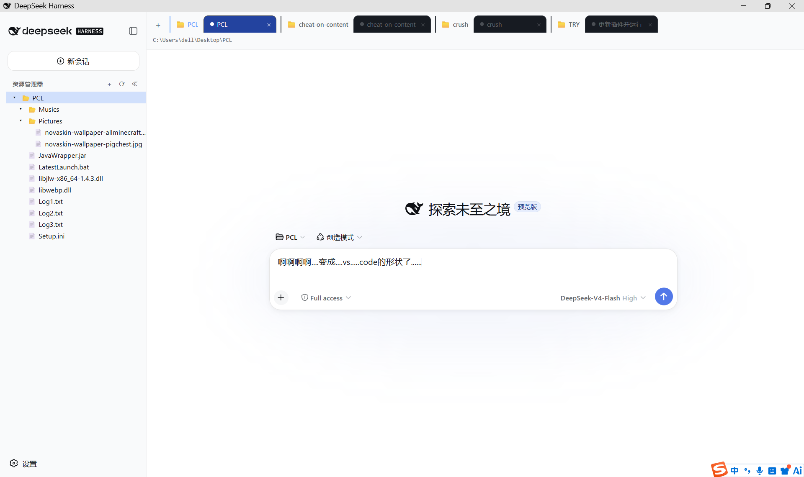

# DSH Explorer 插件


> [!IMPORTANT]
> **让 DSH 变成 VS Code 和浏览器的形状 —— 更适合新手，更简洁易懂。**



一个 [DeepSeek Harness (DSH)](https://github.com/deepseek-ai/deepseek-harness) **静态 bundle 插件**，给 Web 界面加上两个增强：

1. 🗂️ **VS Code 风格资源管理器**（侧边栏文件树）
2. 🌐 **按工作区分组的会话标签页**（浏览器式标签）

安装后常驻生效，不需要每次会话重新加载。

---

## ✨ 功能

### 🗂️ 1. 资源管理器（`sidebar.workspaces`）

- 树形文件浏览：目录可展开/折叠，文件夹优先排序
- 点击文件在底部预览面板显示文本内容
- 新建文件夹、刷新、全部折叠
- 侧边栏收起时显示为一个图标按钮（rail），点击展开

### 🌐 2. 会话标签页（`conversation.session.header`）

- 会话标签**按工作区分组**：每个工作区（📁 + 标题）作为分组头，其下紧跟属于它的会话
- 当前工作区、当前会话高亮
- 点击标签切换会话；「+」新建会话（继承当前工作区）
- 每个标签右侧「×」**直接归档**该会话（不删除会话日志）
- 归档当前会话时自动切到下一个已有会话（右边优先，否则左边），不会卡在「新会话」空态
- 未归入任何工作区的会话归入「未分组」
- 标签过多时支持**鼠标滚轮横向滚动**；切换会话后当前标签会自动滚入视野，不会「点不到后面的标签」

> [!TIP]
> 「+」的语义是**打开该工作区的空闲会话**：已有空闲会话时直接切过去（不会堆出一串空会话），没有才会真正新建。所以当前就在空闲会话上时，点「+」看不出变化是正常的。

---

## 📦 文件结构

| 文件 | 说明 |
| --- | --- |
| `index.js` | **Host 半端**：自包含（用 Node `node:fs`），通过 `ctx.connection.rpc.handle('/explorer', …)` 注册 `list` / `read` / `mkdir` 三个 RPC 端点 |
| `client.js` | **Client bundle**：`window.__ModuleLoader__.load({ id, factory })` 格式，注册两个 slot 并渲染 UI |
| `cordis.patch.yml` | bundle patch：把插件行插入 cordis 配置 |
| `package.json` | 声明 `dsh.bundle.patch`（bundle）与 `dsh.client`（浏览器 bundle） |
| `verify-client.mjs` | 开发用验证脚本：mock `__ModuleLoader__`/react/ctx，离线验证 bundle 结构与渲染 |
| `screenshot.png` | README 顶部的运行效果截图 |

---

## 🚀 安装

### 从 GitHub 安装

```powershell
dsh plugin --profile web add github:WuTong1213/dsh-explorer-plugin
```

> [!NOTE]
> 本插件是**纯 JS、无构建步骤**，所以 Git 安装不需要 `prepare` 脚本，也不需要 `allowBuilds` 放行。

### 从本地目录安装（开发时）

```powershell
# 在插件目录的上一级执行（相对路径会锚定到当前目录）
dsh plugin --profile web add ./dsh-explorer-plugin
```

验证挂载：

```powershell
dsh --profile web --dump-config | Select-String explorer
```

应看到：

```
# == dsh-explorer-plugin
- id: explorer
  name: dsh-explorer-plugin
```

> [!TIP]
> 如果提示 `dsh` 不是可识别的命令，说明 dsh 没在 PATH 上——改用它的完整路径（例如 `<DSH 部署目录>\node_modules\.bin\dsh.cmd`），或先把该目录加入 PATH。

### 重启才生效

> [!WARNING]
> DSH 的 host 插件树和 client module graph **都在启动时组装**，不支持插件级热插拔。安装后必须重启：

```powershell
# 1) 停止当前服务器
.\dsh-window-stop.cmd
# 2) 重新启动
.\dsh-window.cmd
```

（若用 `dsh web` 直接启动，Ctrl+C 后重新运行即可。）

---

## 🗑️ 卸载

```powershell
dsh plugin --profile web remove dsh-explorer-plugin
```

重启后即恢复官方默认的侧边栏与会话头部。

---

## 🏗️ 架构

```
Browser (client.js bundle)                    Host (index.js)
┌──────────────────────────────┐              ┌─────────────────────────┐
│ slot: sidebar.workspaces     │              │ self-contained          │
│ slot: conversation.session…  │              │ (no DSH service dep)    │
│                              │  RPC call    │ rpc.handle('/explorer') │
│ connection.rpc.call(…)   ────┼─────────────▶│   list  → node:fs       │
│                              │              │   read  → node:fs       │
│                              │              │   mkdir → node:fs       │
└──────────────────────────────┘              └─────────────────────────┘
```

- 两个半区**不共享内存**，只通过 `/explorer` RPC 通道通信。
- Host 返回 `{ok:true,value}` / `{ok:false,error}`；业务错误（路径无效、二进制文件）放在 `value.error` 里，由界面就地渲染，不当成传输故障。
- Client 使用 slot 的标准 props（`useSessions`、`useWorkspaces`）与 owner props（`wide`、`expandSidebar`），不额外拉数据。
- 会话的切换/新建/归档走 client 侧已有的 `sessions` / `workspaces` 服务，不占用额外 RPC。

### 为什么 Host 半区不注入 DSH 的 `fs` 服务

> [!NOTE]
> `fs` 服务（`ctx.fs`）的唯一提供者 `dsh-fs-local` **挂在 agent preset 里**（`config/agent-presets/*/agent.cordis.yml`），不在 profile 顶层；profile 顶层同时也没有 `browse` capability。

本插件挂在 profile 顶层，如果写 `inject: ['fs']` 就会永远停在 **PENDING** 而完全不加载。因此 Host 半区直接用 Node 自己的 `node:fs`：

- 全部操作**只读**（`readdir` / `readFile`），唯一写操作是显式的「新建文件夹」（`mkdir`，且拒绝含路径分隔符的名称）。
- 因为不注入任何 DSH 服务，插件是自包含的，也不受 agent realm 的服务可用性影响。

### 会替换官方 UI

> [!IMPORTANT]
> 这两个 slot 都是 `single` 类型（一人独占）。注册即替换官方实现——**官方头部整条（标题、视图标签、模式/Subagent/Task 按钮、日志导出等）都不会再渲染**，这是有意的设计。

- `sidebar.workspaces` —— 会话浏览区
- `conversation.session.header` —— 会话头部

替换的实现方式：官方 UI 以默认优先级 0 注册这两个 slot，本插件以 `priority: -10` 注册（更低优先级渲染，同优先级会直接抛错）。因此官方注册仍然存活，**插件卸载后官方 UI 立刻回到渲染位**。

---

## 🧪 开发与验证

改完代码后，先跑离线验证（不需要重启）：

```powershell
node --check index.js
node --check client.js
node verify-client.mjs
```

`verify-client.mjs` 会 mock `window.__ModuleLoader__`、`react` 和 Cordis client 服务，实际执行 bundle 并渲染两个 slot 组件，能提前发现语法错误、注册失败和渲染崩溃。之后仍需重启才会在页面上生效。

Host 半端也可以离线 smoke：

```powershell
node --input-type=module -e "const m = await import('./index.js'); const ctx = { inject: (d, cb) => cb({ connection: { rpc: { handle: (ch) => console.log('channel', ch) } } }) }; m.apply(ctx)"
```

---

## ⚠️ 已知限制

- 仅支持 Web（`dsh.client.platform: "web"`）。
- 资源管理器根目录跟随当前会话的 `cwd`；没有会话/工作区时显示提示。
- 会话标签只展示工作区记账内的会话；已归档会话隐藏（归档保留日志，不删数据）。
- 文件预览为纯文本，二进制文件会显示「无法预览」。
- 不显示文件大小（避免为每个文件额外 `stat`）。

---

## 📤 发布到 GitHub（作者备忘）

```powershell
cd dsh-explorer-plugin
git init
git add .
git commit -m "feat: DSH explorer plugin (file tree + workspace-grouped session tabs)"
# 先在 github.com 新建空仓库（不要勾 README/.gitignore）
git remote add origin https://github.com/<用户名>/<仓库名>.git
git branch -M main
git push -u origin main
```

---

## 📄 许可证

MIT License
